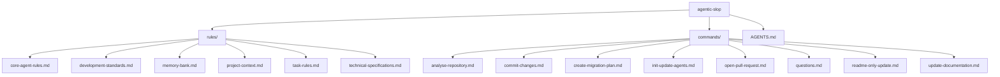
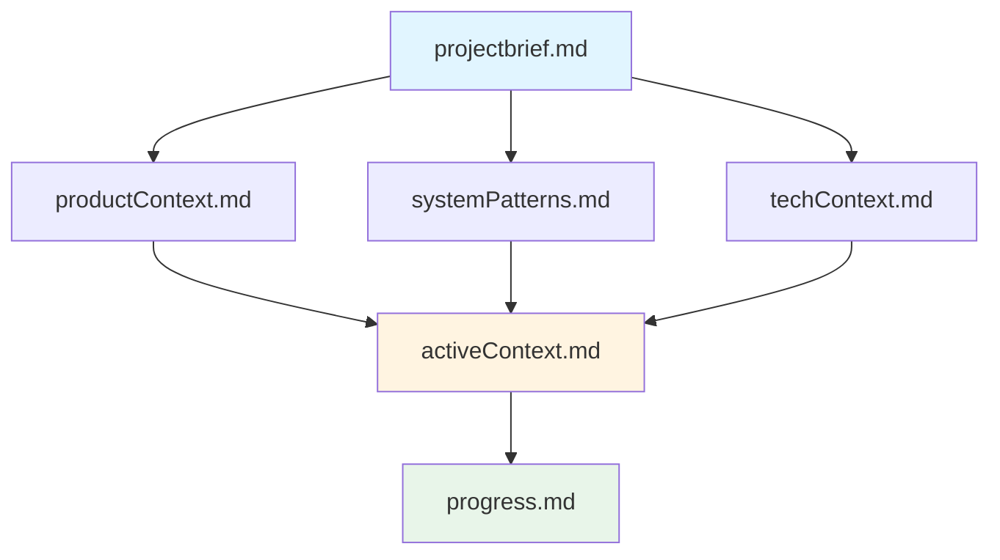
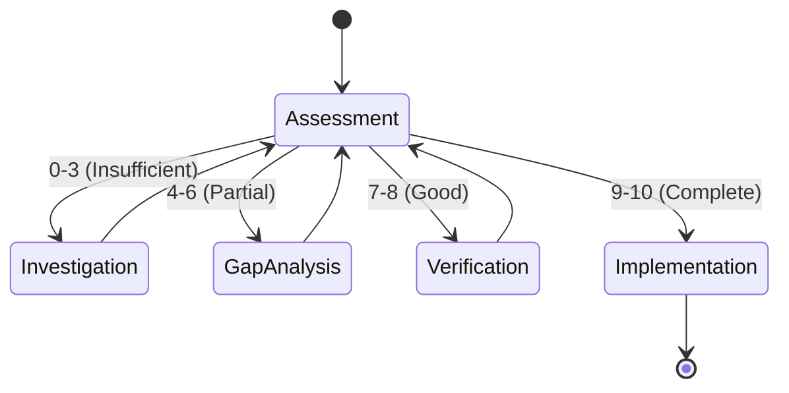

# agentic-slop

Collection of rules, prompts, skills and best practices for agentic coding assistants.

## Overview

This repository provides a comprehensive framework for configuring AI coding assistants to work effectively on software projects. It contains XML-formatted rules and markdown command templates that define behaviour, workflows, and best practices.

**Important**: This is NOT a traditional software project - it's a configuration repository for AI assistants. There are no build commands, tests, or runtime. Users load these rules into their AI coding assistants to improve their effectiveness.

## Repository Structure

### Directory Contents

#### [`rules/`](rules/)
XML-formatted agent behaviour rules that define how AI assistants should reason, respond, and work:

- **[`core-agent-rules.md`](rules/core-agent-rules.md)** - Core principles, memory management, task handoff procedures
- **[`development-standards.md`](rules/development-standards.md)** - Code style, testing patterns, semantic commit messages
- **[`memory-bank.md`](rules/memory-bank.md)** - Memory Bank framework for persistent project context
- **[`project-context.md`](rules/project-context.md)** - Domain terminology and business context
- **[`task-rules.md`](rules/task-rules.md)** - Task breakdown, handoff strategies, workflow requirements
- **[`technical-specifications.md`](rules/technical-specifications.md)** - Tooling requirements, British English standards

#### [`commands/`](commands/)
Markdown templates for common AI assistant workflows:

- **[`analyse-repository.md`](commands/analyse-repository.md)** - Comprehensive codebase analysis framework
- **[`commit-changes.md`](commands/commit-changes.md)** - Git commit workflow with semantic messages
- **[`create-migration-plan.md`](commands/create-migration-plan.md)** - Migration planning template
- **[`init-update-agents.md`](commands/init-update-agents.md)** - Debug mode rules for non-obvious issues
- **[`open-pull-request.md`](commands/open-pull-request.md)** - Pull request creation workflow
- **[`questions.md`](commands/questions.md)** - Question framework for clarification
- **[`readme-only-update.md`](commands/readme-only-update.md)** - Documentation update workflow
- **[`update-documentation.md`](commands/update-documentation.md)** - Comprehensive documentation updates

#### [`AGENTS.md`](AGENTS.md)
Consolidated guidance file for AI assistants with mode-specific sections (Architect, Ask, Code, Debug modes). Contains non-obvious conventions and patterns discovered by analyzing the rules.

## Key Concepts

### Memory Bank Framework

The Memory Bank is a two-tier memory system for AI assistants:

- **`.memory-bank/`** - Persistent project context (never cleared)
- **`./agent_docs/`** - Ephemeral task handoff documentation (cleared between major tasks)

### Context Window Management

Critical workflow requirement:
- Monitor context window usage in environment details
- **At 70% usage** (e.g., 140K/200K tokens), initiate task handoff
- Use `ask_followup_question` → `new_task` tool sequence
- Prevents memory loss and context corruption

### Confidence-Based Workflow

AI assistants must rate understanding 0-10 before implementation:

- **0-3**: Stop, investigate thoroughly
- **4-6**: Stop, address knowledge gaps
- **7-8**: Verify edge cases
- **9-10**: Proceed with implementation

### Semantic Commit Messages

All commits must follow Conventional Commits specification:

**Format**: `type(scope): description`

**Types**: feat, fix, docs, style, refactor, test, chore, perf, ci, build, revert

**Examples**:
- `feat(auth): add two-factor authentication`
- `fix(api): resolve race condition in user creation`
- `docs: update installation instructions`

## Usage

### For AI Assistants

1. Read [`AGENTS.md`](AGENTS.md) first for project overview
2. Load relevant rules from [`rules/`](rules/) directory based on task
3. Follow rule hierarchy: core → development → task → technical
4. Use commands from [`commands/`](commands/) as workflow templates
5. Apply Memory Bank framework for project context management

### For Developers

1. Clone this repository
2. Configure your AI coding assistant to load these rules
3. Reference [`AGENTS.md`](AGENTS.md) for quick guidance
4. Invoke commands as needed for specific workflows
5. Customize rules for your project-specific needs

## Requirements

- AI coding assistant with tool-use capabilities
- Git for version control
- Text editor for viewing/editing rules

## Non-Obvious Conventions

- **British English**: All outputs must use British English spelling (-our, -ise, -re, -ll-)
- **Git `--no-pager`**: Always use `git --no-pager` for commands (terminal output limitation)
- **"dissuing" → "issuing"**: Common typo/abbreviation in repository names
- **"WE CAN DO IT"**: Memory check protocol response
- **Rule IDs**: Rules with IDs (e.g., `<RULE id="CWM001">`) take precedence over general guidelines

## Contributing

When contributing to this repository:

1. Follow semantic commit message format
2. Use British English spelling
3. Maintain XML structure for rules
4. Keep markdown lists using single dash: `- item`
5. Focus on non-obvious, project-specific information
6. Ask before pushing to remote

## License

See [`LICENSE`](LICENSE) file for details.

## Related Resources

- [Conventional Commits](https://www.conventionalcommits.org/)
- [Semantic Versioning](https://semver.org/)
